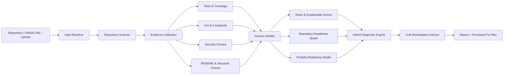

# DrRepo 🩺

> **Evidence-driven repository health, readiness, and remediation platform for Python projects.**

DrRepo audits a software repository and turns raw engineering signals into a clear diagnosis: what is working, what is missing, what should be fixed first, and whether the project is technically ready or portfolio-ready.

It is designed as a portfolio project that combines **software engineering, static analysis, machine learning, MLOps, DevOps, and LLM-assisted remediation**—not as a simple “paste code into an AI chat” wrapper.

> **Status:** Planning / architecture phase (v0.3)  
> **Primary language in the first implementation:** Python  
> **Primary product mode:** Repository Audit  
> **Secondary product mode:** Pull Request / Change Impact Review

---

## Why DrRepo?

A general AI assistant can read code and give suggestions. DrRepo is intended to do more than that:

- collect **repeatable evidence** from tests, coverage, linters, security scanners, complexity analysis, README checks, and repository-structure checks;
- calculate **explainable health dimensions**, not one opaque opinion;
- run two ML classifiers that learn repository-level and portfolio-level readiness patterns;
- use an LLM to turn evidence into a **prioritized remediation plan**;
- later compare a pull request against an existing repository baseline and run as a CI quality gate.

The product question is not merely *“Is this code good?”* It is:

> **What is wrong, where is the evidence, what should be fixed first, and how did the repository improve after the changes?**

---

## Core capabilities

### 1. Repository Audit — core mode

DrRepo analyzes a whole Python repository and reports:

- code quality and lint findings;
- test availability, test status, and coverage;
- security findings and unsafe patterns;
- complexity and maintainability signals;
- README completeness and documentation quality;
- repository structure and reproducibility signals;
- repository health / readiness prediction;
- a prioritized action plan.

### 2. Portfolio Readiness Audit — core mode

DrRepo evaluates whether a repository is ready to be displayed in a GitHub profile, CV, internship application, or interview.

It considers README quality, setup instructions, usage examples, architecture explanation, demo or screenshots, reproducibility, tests, documentation, project structure, and professional polish.

### 3. Quick File / Code Review — supporting mode

A future web interface can accept a single source file or pasted code. This mode will provide a **code-level** review only; it will not claim to know the health of a repository that it has not seen.

### 4. Pull Request / Change Impact Review — later mode

DrRepo will later inspect a PR diff against the repository baseline, identify regressions, and optionally act as a configurable GitHub Actions quality gate.

---

## Planned input methods

| Input | Intended use | Initial status |
|---|---|---|
| Local folder | CLI audit of a repository on the user’s machine | First implementation |
| Public GitHub URL | Clone into a temporary workspace and audit | After local audit is stable |
| ZIP / uploaded project | Web-app upload for a complete project | Future web phase |
| Single file | Quick code-level analysis | Future web phase |
| Pasted code | Quick code-level analysis | Future web phase |
| Private GitHub repository | Requires OAuth/token permissions | Deferred; use local folder or ZIP instead |

For browsers, a ZIP archive is the reliable default for a full-folder upload. Directory selection may be offered later as a convenience, but it is not a required contract.

---

## How the system works



### Decision layers

| Layer | Job |
|---|---|
| Deterministic checks | Collect factual findings: test status, coverage, lint/security findings, complexity, README and structure signals. |
| Rule-based scoring | Produce transparent category scores and enforce configured hard rules where appropriate. |
| ML classifiers | Learn broader readiness patterns from engineered repository features. They are advisory signals, not the only authority. |
| LLM remediation advisor | Explain evidence, group related findings, prioritize fixes, suggest tests/README improvements, and later suggest patches. |
| Hybrid diagnosis engine | Produces the final report while preserving evidence and avoiding opaque decisions. |

---

## Planned ML components

### Repository Health / Readiness Classifier

**Question:** Is this repository technically ready, or does it need improvement?

Proposed labels, subject to dataset validation:

```text
needs_major_improvement
needs_improvement
repository_ready
```

Example features include test availability, test pass rate, coverage, lint/security counts, complexity statistics, dependency configuration, README completeness, structure signals, and documentation signals.

### Portfolio Readiness Classifier

**Question:** Is this repository ready to be presented publicly?

Proposed labels, subject to dataset validation:

```text
not_portfolio_ready
almost_ready
portfolio_ready
```

Example features include README sections, install/run instructions, usage examples, architecture explanation, tests, screenshots/demo evidence, reproducibility files, professional metadata, and repository organization.

### Data strategy

The final dataset plan is intentionally flexible. It is expected to combine:

- manually reviewed and labeled repositories using a documented rubric;
- selected public Python repositories under explicit collection criteria;
- synthetic good/bad repositories for testing and edge cases;
- DrRepo audit history later, where appropriate.

The project will **not** claim that a model is independently intelligent if its labels are merely copied from the same rules used as input features. Labeling, leakage prevention, dataset versioning, and baseline comparisons are part of the ML phase.

---

## Technology direction

| Area | Planned choice |
|---|---|
| Language | Python |
| CLI | Typer (proposed) |
| Static analysis | Ruff, Bandit, Radon |
| Testing and coverage | Pytest, coverage.py |
| API | FastAPI, after the core engine is stable |
| Reports | Markdown, JSON, terminal summary |
| ML | scikit-learn first; XGBoost only if justified |
| Experiment tracking | MLflow in the model phase |
| CI | GitHub Actions |
| Containers | Docker; Docker Compose later |
| Web UI | Simple web UI or Streamlit first; React/Next.js optional |
| LLM providers | Configurable direct provider interface; OpenRouter or local models are possible later |

---

## Development order

```text
1. Local repository scanner
2. Deterministic audit evidence
3. Scores, diagnosis, and reports
4. Public GitHub URL audit
5. Dataset and ML foundation
6. Two readiness classifiers + MLflow
7. LLM remediation advisor
8. Pull Request / Change Impact Review with GitHub Actions
9. Web app, uploads, and dashboard
10. Production polish, Docker, optional monitoring
```

The web app is part of the product vision, but it will not be built before the audit engine has a reliable interface and report contract.

---

## Repository structure — planned

```text
drrepo/
├── drrepo/
│   ├── cli.py
│   ├── config.py
│   ├── input/
│   ├── scanner/
│   ├── analyzers/
│   ├── audits/
│   ├── features/
│   ├── scoring/
│   ├── diagnosis/
│   ├── ml/
│   ├── llm/
│   ├── reports/
│   ├── github/
│   ├── api/
│   └── storage/
├── docs/
├── examples/
├── tests/
├── reports/
├── .github/workflows/
├── pyproject.toml
└── README.md
```

---

## What DrRepo is not

- It is not a replacement for human reviewers, security specialists, or enterprise security platforms.
- It is not a promise that a project is bug-free or safe.
- It does not automatically execute untrusted uploaded projects on a web server without isolation.
- It does not support private GitHub repositories in the initial scope.
- It does not rely on an LLM as the only source of truth.

---

## Documentation

- [Project Blueprint](docs/PROJECT_BLUEPRINT.md) — product scope, decisions, models, risks, and architecture direction.
- [Architecture](docs/ARCHITECTURE.md) — component boundaries, data flow, input handling, security boundaries, and ML/MLOps design.
- [Roadmap](docs/ROADMAP.md) — phases, acceptance criteria, dependencies, and scope control.

---

## Interview pitch

> **DrRepo is an evidence-driven repository health and remediation platform for Python projects. It combines test and coverage results, static analysis, security checks, complexity metrics, README and structure auditing, two ML readiness classifiers, and LLM-assisted remediation planning. The system produces explainable repository and portfolio readiness reports, then later extends the same audit engine into GitHub Actions-based pull request change-impact reviews.**

---

## License

Planned: choose a license before publishing the implementation repository.
