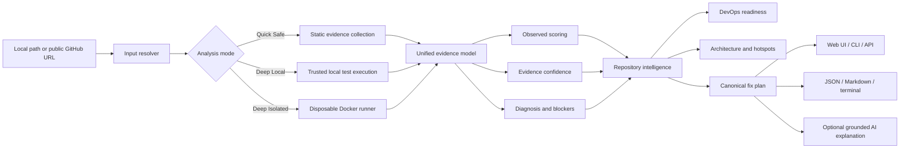

<p align="center">
  
</p>

<h1 align="center">DrRepo</h1>

<p align="center">
  <strong>Evidence-driven repository auditing, readiness intelligence, and prioritized remediation for Python projects.</strong>
</p>

<p align="center">
  DrRepo answers three questions clearly: <strong>What was verified?</strong> <strong>How confident is the diagnosis?</strong> <strong>What should be fixed first?</strong>
</p>

<p align="center">
  
  
  
  
  
  
</p>

<p align="center">
  <a href="#quick-start">Quick Start</a> ·
  <a href="#what-drrepo-does">Capabilities</a> ·
  <a href="#analysis-modes-and-safety">Safety Model</a> ·
  <a href="#api">API</a> ·
  <a href="#current-status-and-roadmap">Roadmap</a>
</p>

---

## Why DrRepo?

Repository-review tools often produce either a long list of disconnected warnings or an AI-generated opinion with unclear evidence.

DrRepo takes a different approach. It collects bounded engineering evidence, separates the **observed score** from **evidence confidence**, identifies confirmed blockers, understands the project shape, and returns a canonical fix plan ordered around the user's goal.

> **DrRepo does not ask an LLM to decide whether a repository is healthy.** Deterministic evidence, scoring, diagnosis, and recommendations remain the source of truth. AI is optional and may only explain or prioritize evidence that DrRepo already verified.

### What makes it different

- **Evidence before conclusions** — findings retain analyzer, file, line, outcome, and execution context where available.
- **Score is not certainty** — skipped or unavailable tools reduce evidence confidence instead of pretending the repository is perfect or automatically bad.
- **Safe execution choices** — public repositories default to static, non-executing analysis; trusted code can be tested locally or inside a disposable Docker environment.
- **Actionable output** — findings become a profile-aware fix plan with steps and success checks.
- **One engine, multiple interfaces** — the same audit contract powers the web app, CLI, FastAPI API, JSON, Markdown, and terminal summary.

---

## What DrRepo does

### Repository evidence

DrRepo currently integrates:

- **Ruff** for code-quality and lint evidence;
- **Bandit** for security findings;
- **Radon** for complexity and maintainability signals;
- **pytest** for typed test outcomes;
- **coverage.py** for coverage evidence;
- a **README auditor** for setup, usage, testing, license, and project-context signals;
- a **repository-structure auditor** for packaging and organization evidence.

Analyzer results are typed as completed, partial, skipped, unavailable, failed, timed out, or environment-limited. Optional-tool failure is reported as an audit-environment limitation rather than silently blamed on the target repository.

### Repository intelligence

DrRepo derives a deterministic project understanding that can include:

- project type and likely purpose;
- detected frameworks and interfaces;
- package, backend, frontend, test, and script layout;
- entry points;
- install, run, test, and build commands;
- dependency strategy and runnability evidence;
- profile-specific recommendations.

### DevOps and release readiness

Release readiness is assessed separately from general repository health across applicable dimensions:

- CI/CD;
- containerization;
- deployment configuration;
- configuration and secret handling;
- observability and operations;
- release hygiene;
- reproducibility.

The result includes an independent readiness score, confidence, blockers, positive signals, and the next release action.

### Architecture intelligence and risk hotspots

DrRepo statically maps Python architecture without importing or executing the target project. It detects:

- modules and inferred layers;
- internal and external import relationships;
- entry points and API boundaries;
- directly observed test relationships;
- strongly connected import cycles;
- coupling and dependency-centrality signals;
- explainable hotspots based on complexity, findings, centrality, cycles, role importance, size, and test evidence.

Architecture results are intentionally heuristic and bounded; uncertainty is reported instead of hidden.

### Optional grounded AI advisor

When explicitly enabled, DrRepo sends a **bounded, redacted evidence summary** to a configured provider. The provider response must pass:

1. the shared structured-output schema;
2. deterministic validation;
3. evidence-grounding checks.

Unsupported claims or invalid responses are rejected, and DrRepo falls back to deterministic guidance without altering the audit score, verdict, findings, or recommendations.

Supported routes currently include:

- Google Gemini (`gemini-2.5-flash`);
- Groq fallback;
- Cerebras fallback;
- deterministic local fallback.

---

## Product experience

The React web application presents the audit in four user-facing views:

| View | Purpose |
|---|---|
| **Summary** | Verdict, observed score, evidence confidence, blockers, project identity, and the recommended next move. |
| **Fix Plan** | The canonical deterministic action plan, with optional AI explanation clearly labeled as secondary. |
| **Issues** | Findings grouped by user-facing priority, with technical evidence available on demand. |
| **Technical Details** | Release readiness, architecture, analyzer evidence, metadata, exports, and Markdown preview. |

The UI includes:

- local-path and public-GitHub audit flows;
- recommended modes with advanced controls behind disclosure;
- Light, Dark, and System theme behavior;
- mobile-safe GitHub URL auditing;
- recent audit shortcuts stored only in the browser;
- JSON and Markdown export;
- accessible tabs, disclosures, focus states, and reduced-motion handling.

---

## Analysis modes and safety

| Mode | Intended use | Executes target code? | Default |
|---|---|---:|---|
| `quick_safe` | Public GitHub repositories or static-only review | No | GitHub URL |
| `deep_local` | A trusted local repository | Yes, through pytest/coverage when available | Local path |
| `deep_isolated` | Explicit opt-in verification inside Docker | Yes, inside a disposable container | Never automatic |

### Deep Isolated safeguards

The isolated runner uses a controlled image and a restricted container profile, including:

- non-root execution;
- dropped Linux capabilities;
- `no-new-privileges`;
- PID, memory, CPU, and timeout limits;
- no Docker socket mounting;
- no host-secret mounting;
- no network during test execution;
- optional, explicit dependency installation in a separate bounded phase.

Dependency installation may execute package build hooks inside the container, so it remains an explicit user choice.

---

## How DrRepo works


```mermaid
flowchart LR
    A[Local path or public GitHub URL] --> B[Input resolver]
    B --> C{Analysis mode}

    C -->|Quick Safe| D[Static evidence collection]
    C -->|Deep Local| E[Trusted local test execution]
    C -->|Deep Isolated| F[Disposable Docker runner]

    D --> G[Unified evidence model]
    E --> G
    F --> G

    G --> H[Observed scoring]
    G --> I[Evidence confidence]
    G --> J[Diagnosis and blockers]

    H --> K[Repository intelligence]
    I --> K
    J --> K

    K --> L[DevOps readiness]
    K --> M[Architecture and hotspots]
    K --> N[Canonical fix plan]

    N --> O[Web UI / CLI / API]
    N --> P[JSON / Markdown / terminal]
    N --> Q[Optional grounded AI explanation]
```

### Trust model

DrRepo deliberately keeps these concepts separate:

- **Observed score** — performance across evidence that was actually assessed.
- **Evidence confidence** — how complete and reliable the available audit evidence is.
- **Diagnosis** — the user-facing claim supported by that evidence.
- **Hard blockers** — confirmed high-impact conditions, not every missing polish item.
- **Recommendations** — deterministic, ordered actions derived from findings and project context.

---

## Advisor profiles

The same repository may need different priorities depending on its purpose. DrRepo supports:

| Profile ID | Best for |
|---|---|
| `student_portfolio` | Student projects where clarity, presentation, reproducibility, and trustworthy basics matter. |
| `open_source_library` | Reusable packages that need strong docs, tests, packaging, and contribution readiness. |
| `production_service` | Services that prioritize reliability, security, configuration, and deployment safety. |
| `production_api` | APIs where testing, security, dependency locking, logging, and health checks matter most. |
| `ai_ml_project` | ML, inference, RAG, and experiment repositories focused on reproducibility, data, metrics, and limitations. |
| `learning_or_research_project` | Coursework, experiments, or research artifacts that must be understandable and repeatable. |

Profiles change recommendation emphasis; they do **not** rewrite repository evidence.

---

## Quick start

### Requirements

- Python `3.11+`
- Node.js and npm
- Git
- Docker Desktop only for `deep_isolated`

### 1. Clone and install

```bash
git clone https://github.com/karimsamer100/DrRepo.git
cd DrRepo

python -m venv .venv
```

Activate the environment:

```bash
# Windows PowerShell
.venv\Scripts\Activate.ps1

# macOS / Linux
source .venv/bin/activate
```

Install DrRepo and its development analyzers:

```bash
python -m pip install --upgrade pip
python -m pip install -e ".[dev]"
```

### 2. Build the frontend

```bash
cd frontend
npm install
npm run build
cd ..
```

### 3. Run the complete application

```bash
python -m uvicorn drrepo.api.app:app --host 0.0.0.0 --port 8000 --reload
```

Open:

```text
http://localhost:8000
```

The FastAPI application serves the built frontend automatically when `frontend/dist` exists.

### Frontend development mode

Run the API:

```bash
python -m uvicorn drrepo.api.app:app --host 0.0.0.0 --port 8000 --reload
```

In another terminal:

```bash
cd frontend
npm run dev
```

Then open `http://localhost:5173`.

---

## CLI examples

### Audit a trusted local repository

```bash
drrepo audit . \
  --analysis-mode deep_local \
  --profile student_portfolio \
  --format summary
```

### Audit a public GitHub repository safely

```bash
drrepo audit https://github.com/owner/repository \
  --analysis-mode quick_safe \
  --profile open_source_library \
  --format markdown \
  --output audit-report.md
```

### Use the optional AI advisor

```bash
drrepo audit . \
  --analysis-mode deep_local \
  --profile production_api \
  --ai \
  --format markdown
```

### Run supported checks in Docker isolation

```bash
drrepo audit https://github.com/owner/repository \
  --analysis-mode deep_isolated \
  --install-dependencies \
  --allow-install-network \
  --isolated-timeout 300 \
  --format summary
```

---

## API

| Method | Endpoint | Description |
|---|---|---|
| `GET` | `/health` | API health and version. |
| `GET` | `/api/profiles` | Supported advisor profiles. |
| `GET` | `/api/capabilities` | Analysis modes, analyzers, Docker state, AI state, and local-path policy. |
| `POST` | `/api/audits` | Run a repository audit. |

Example request:

```bash
curl -X POST http://localhost:8000/api/audits \
  -H "Content-Type: application/json" \
  -d '{
    "source_type": "github_url",
    "source_value": "https://github.com/owner/repository",
    "profile_id": "student_portfolio",
    "analysis_mode": "quick_safe",
    "ai": false,
    "include_markdown": true
  }'
```

---

## Configuration

Create a `.env` file from `.env.example` when provider access is needed.

| Variable | Purpose |
|---|---|
| `GEMINI_API_KEY` or `GOOGLE_API_KEY` | Enable the primary Gemini advisor route. |
| `GROQ_API_KEY` | Enable the Groq fallback route. |
| `CEREBRAS_API_KEY` | Enable the Cerebras fallback route. |
| `DRREPO_API_CORS_ORIGINS` | Comma-separated frontend origins allowed by the API. Defaults to `http://localhost:5173`. |
| `DRREPO_LOCAL_PATH_AUDITS` | Set to `false` on public deployments to disable server-filesystem path auditing. |
| `DRREPO_ALLOWED_ROOTS` | Optional allowlist of server roots available to local-path audits. |
| `DRREPO_FRONTEND_DIST` | Optional path to the built frontend directory served by FastAPI. |
| `VITE_API_BASE` | Frontend API base URL when the frontend and API are deployed separately. |

### Recommended public deployment policy

```env
DRREPO_LOCAL_PATH_AUDITS=false
DRREPO_API_CORS_ORIGINS=https://your-frontend-domain.example
```

Keep all provider keys in the backend environment only. Never expose them through Vite variables, frontend bundles, source control, reports, or screenshots.

---

## Repository structure

```text
DrRepo/
├── drrepo/
│   ├── advisor/        # deterministic and grounded AI advisor pipeline
│   ├── analyzers/      # Ruff, Bandit, Radon, pytest, coverage, README, structure
│   ├── api/            # FastAPI boundary and public/local-path policies
│   ├── architecture/   # static graph, cycles, test links, and hotspots
│   ├── diagnosis/      # evidence-aware claims and blockers
│   ├── execution/      # isolated Docker command planning and execution
│   ├── features/       # normalized repository features
│   ├── input/          # local/GitHub resolution and temporary workspaces
│   ├── intelligence/   # identity, runnability, commands, recommendations
│   ├── ml/             # dataset, leakage, evaluation, and baseline foundation
│   ├── readiness/      # DevOps and release-readiness assessment
│   ├── reports/        # Markdown and terminal reports
│   ├── scanner/        # repository metadata collection
│   ├── scoring/        # observed scoring and assessment state
│   ├── audit.py        # shared audit orchestration
│   └── cli.py          # Typer CLI
├── frontend/           # React, TypeScript, Vite, and Tailwind product UI
├── tests/              # unit, integration, contract, and security-boundary tests
├── examples/           # known-good and known-bad sample repositories
├── docs/               # blueprint, architecture, roadmap, and master plan
├── pyproject.toml
└── README.md
```

---

## Testing

Run the full Python suite:

```bash
python -m pytest -q
```

Build and type-check the frontend:

```bash
cd frontend
npm run build
```

Latest verified release checkpoint:

```text
689 passed
Frontend production build passed
```

No live LLM or external-provider calls are required by the automated test suite; provider behavior is tested through controlled mocks and fixtures.

---

## Current status and roadmap

### Implemented

- deterministic repository auditing;
- calibrated observed scoring and evidence confidence;
- local-path and public-GitHub inputs;
- Quick Safe, Deep Local, and Deep Isolated modes;
- Ruff, Bandit, Radon, pytest, coverage, README, and structure evidence;
- repository identity, runnability, command inference, and action planning;
- DevOps and release-readiness intelligence;
- static architecture graph and explainable risk hotspots;
- grounded, optional multi-provider AI advisor with deterministic fallback;
- CLI, FastAPI, React web UI, JSON, Markdown, and terminal outputs;
- Light/Dark/System themes and responsive GitHub-audit flow;
- extensive automated test coverage.

### Next release work

- public deployment configuration and hosted demo;
- CI workflow and release automation;
- final screenshots and short demo video;
- audit history and comparison;
- pull-request change-impact review;
- private-repository support with explicit authentication;
- learned readiness models only after defensible datasets and evaluation exist.

> The `drrepo/ml` package currently provides dataset, rubric, leakage, split, quality, and baseline foundations. DrRepo does **not** market a rule-based baseline as a trained intelligent classifier.

---

## Limitations

- DrRepo is currently focused on Python repositories; frontend/JavaScript understanding is intentionally conservative.
- Quick Safe does not execute target tests or coverage.
- Static architecture inference cannot replace runtime tracing or a human architecture review.
- A strong observed score with limited evidence is not equivalent to full verification.
- AI guidance depends on provider availability and is always secondary to deterministic evidence.
- DrRepo is not a security certification, penetration test, or guarantee that a repository is bug-free.
- Private GitHub repositories are not currently part of the public URL flow.

---

## Documentation

- [Project Blueprint](docs/PROJECT_BLUEPRINT.md) — product scope, decisions, risks, and contracts.
- [Architecture](docs/ARCHITECTURE.md) — component boundaries, execution modes, trust boundaries, and data flow.
- [Roadmap](docs/ROADMAP.md) — implementation phases and acceptance criteria.
- [Master Plan](docs/DrRepo-MasterPlan.md) — wider product direction and long-term possibilities.

---

## Portfolio pitch

> **DrRepo is an evidence-driven repository audit platform that combines static analysis, typed test and coverage outcomes, calibrated scoring, project intelligence, release readiness, architecture hotspots, and grounded AI explanation. It distinguishes observed quality from evidence confidence, provides safe analysis modes for trusted and untrusted repositories, and turns disconnected engineering signals into a prioritized, explainable fix plan.**

---

## Contributing

DrRepo is currently being prepared for its first public release. Bug reports, reproducible audit cases, analyzer adapters, and evidence-model improvements are welcome once contribution guidelines are published.

---

## License

A project license has not been selected yet. Until a license file is added, the repository remains under the default copyright restrictions.
