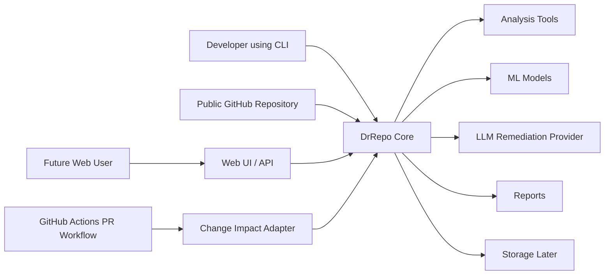
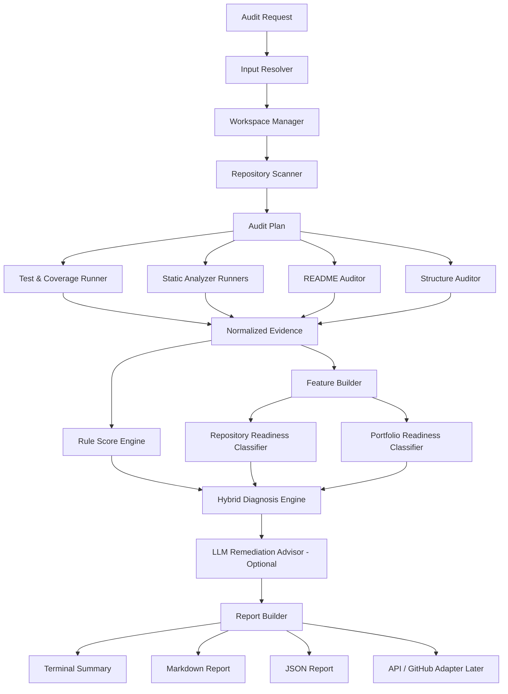

# DrRepo — Architecture

> **Status:** Architecture baseline, v0.3  
> This document defines component boundaries and data flow. It is a design guide, not a claim that every component already exists.

---

## 1. Architecture goals

DrRepo must be designed so that:

1. the same audit engine can power CLI, GitHub URL audit, web API, and PR review;
2. deterministic evidence remains traceable and separate from model/LLM reasoning;
3. ML features are stable, versioned, and reproducible;
4. the web architecture does not require unsafe execution of untrusted code;
5. a future dashboard can consume stored audit reports without reimplementing the analyzer;
6. the project can grow phase by phase without a rewrite.

---

## 2. Context diagram



### Boundary rule

`DrRepo Core` must not depend on CLI formatting, HTML templates, GitHub Actions YAML, or a specific LLM vendor. Those are adapters around a reusable service layer.

---

## 3. Core pipeline



---

## 4. Request and input architecture

## 4.1 Unified audit request

All interfaces should create an internal `AuditRequest` rather than calling tool runners directly.

Conceptual fields:

```python
@dataclass
class AuditRequest:
    source_type: Literal[
        "local_path", "github_url", "zip_upload", "single_file", "code_text", "pull_request"
    ]
    source_value: str | Path
    mode: Literal["repository", "portfolio", "quick_review", "pull_request"]
    profile: str = "general_python"
    config_path: Path | None = None
    run_id: str | None = None
```

This is a conceptual shape only. The final project may use Pydantic models instead.

## 4.2 Input resolver responsibilities

| Input | Resolver behavior | Notes |
|---|---|---|
| Local path | Validate directory, normalize path, identify repo root | MVP |
| Public GitHub URL | Validate URL, clone/download to temp workspace, clean up | Later |
| ZIP upload | Validate archive, extract safely, detect root | Web phase |
| File upload | Build a quick-review workspace | Web phase |
| Code text | Build an in-memory/scoped workspace | Web phase |
| PR context | Resolve base/head refs and diff | PR phase |

## 4.3 Private repository boundary

Private GitHub repositories are **not initially supported through URLs**. The project will not store GitHub tokens or implement OAuth in the early scope.

Supported alternatives in the initial product direction:

- local CLI audit;
- later ZIP upload handled under web safety constraints.

---

## 5. Workspace and execution safety

## 5.1 Local CLI mode

The local CLI may run configured checks because the user controls the repository and environment. Even here, commands must be explicit, logged, time-limited where possible, and error-aware.

## 5.2 Public GitHub URL mode

Cloned repositories should use a temporary workspace:

```text
create temporary directory
→ clone with limits
→ analyze
→ preserve only intended report/raw evidence
→ remove workspace
```

## 5.3 Web upload mode — future security boundary

A web server must treat uploaded code as untrusted.

### Initial web-safe approach

- static inspection first;
- no arbitrary `pytest`, install script, shell script, or project entry point execution by default;
- archive size and file-count limits;
- path traversal protection during extraction;
- temporary workspace cleanup;
- secrets redaction/ignore rules where feasible.

### Advanced future approach

Run selected commands only inside isolated containers or sandboxes with:

- restricted filesystem;
- no privileged execution;
- limited CPU and memory;
- short timeout;
- restricted network;
- command allowlist;
- cleanup and audit logging.

The web app is a product feature, but safety design is a mandatory prerequisite for executing untrusted repository tests.

---

## 6. Evidence layer

## 6.1 Normalized evidence contract

Every analyzer should return structured, normalized output. The rest of DrRepo must not parse human tool text repeatedly.

Conceptual envelope:

```json
{
  "tool": "ruff",
  "status": "completed",
  "started_at": "...",
  "duration_ms": 310,
  "summary": {
    "issue_count": 5
  },
  "findings": [],
  "raw_artifact_path": "...",
  "errors": []
}
```

### Required status distinctions

```text
completed
not_available
not_applicable
skipped_by_config
failed_to_run
partial
```

This prevents false conclusions such as treating “coverage could not run” as “coverage is 0%.”

## 6.2 Tool adapters

Initial adapters:

| Tool | Purpose | Planned output |
|---|---|---|
| Ruff | lint/code-quality signals | issue count, categories, locations |
| Bandit | Python security findings | severity, confidence, locations |
| Radon | complexity/maintainability signals | complexity statistics, functions |
| Pytest | test discovery and status | passed/failed/skipped/errors |
| coverage.py | coverage measurement | percent, availability, report |

Potential later adapters: mypy, Semgrep, pip-audit, profile-specific tools, IaC linters.

## 6.3 Repository metadata evidence

The repository scanner creates metadata including:

- file/folder tree summary;
- Python source count;
- tests presence;
- README and docs presence;
- dependency/configuration files;
- environment files;
- Docker/CI signals;
- likely application type;
- ignored/generated file signals.

## 6.4 README and structure evidence

README and structure modules should emit findings with identifiers, not only a score:

```text
README-SETUP-MISSING
README-USAGE-MISSING
STRUCTURE-TESTS-MISSING
STRUCTURE-ENV-EXAMPLE-MISSING
```

This makes reports, rules, ML features, and LLM explanations refer to the same evidence.

---

## 7. Feature-engineering layer

## 7.1 Purpose

The feature builder transforms normalized evidence into a stable tabular feature schema for both ML models.

It must be independent from the CLI/UI and versioned over time.

## 7.2 Proposed feature groups

| Group | Examples |
|---|---|
| Repository size | file count, source file count, LOC, module count |
| Testing | tests present, test status, test count, coverage, coverage availability |
| Code quality | lint counts, issue density, selected categories |
| Security | Bandit counts by severity, secret flags, unsafe patterns |
| Maintainability | complexity mean/max, high-complexity count, large file count |
| Structure | src/tests/docs existence, dependency file, gitignore, env example |
| Documentation | README section flags, setup/usage/architecture/results indicators |
| Presentation | demo/screenshot, license, author/contact, portfolio metadata |

## 7.3 Feature schema rules

- Define a feature schema version, for example `v1`.
- Validate that required fields exist before inference.
- Preserve unknown values rather than silently converting them to zero.
- Keep raw evidence references available for explainability.
- Avoid features that leak the final label.

---

## 8. Rules, ML, and LLM orchestration

## 8.1 Rule score engine

The rule score engine computes transparent category scores from evidence. It is expected to be the first working diagnosis layer.

Inputs: normalized evidence + configuration.  
Outputs: category scores, deduction reasons, hard flags, missing-data notes.

## 8.2 Repository readiness classifier

Inputs: feature schema vector.  
Output: predicted readiness class + probability/confidence + model version.

The model does **not** replace hard evidence. A project with a critical security flag must visibly show that flag even if the model predicts a favorable class.

## 8.3 Portfolio readiness classifier

Inputs: feature schema vector, emphasizing presentation and reproducibility features.  
Output: predicted portfolio class + probability/confidence + model version.

## 8.4 LLM remediation advisor

Inputs: bounded evidence bundle, top findings, scores, model predictions, audit profile.  
Output: validated remediation plan and explanation.

The LLM must not be given unrestricted access to a private repository or secrets. Future provider calls require explicit context selection/redaction policy.

## 8.5 Hybrid diagnosis engine

Conceptual output:

```json
{
  "repository_health": {
    "rule_score": 68,
    "diagnosis": "needs_improvement",
    "model_prediction": "needs_improvement",
    "model_confidence": 0.74
  },
  "portfolio_readiness": {
    "rule_score": 58,
    "prediction": "almost_ready",
    "model_confidence": 0.66
  },
  "hard_flags": ["TESTS_FAILING"],
  "top_findings": [],
  "evidence_coverage": [],
  "limitations": []
}
```

When rules and model disagree, the report should disclose that disagreement rather than hide it.

---

## 9. Report architecture

## 9.1 Report formats

| Format | Purpose |
|---|---|
| Terminal | Fast feedback during CLI use |
| JSON | Machine-readable artifact, API integration, dataset builder |
| Markdown | Human-readable GitHub/report artifact |
| HTML/PDF | Future downloadable web reports |

## 9.2 Report sections

1. audit scope and input type;
2. executive summary;
3. evidence availability and limitations;
4. health and portfolio scores;
5. model predictions and model metadata;
6. key findings with evidence;
7. prioritized remediation plan;
8. raw-tool summary / appendix;
9. rerun instructions and configuration reference.

---

## 10. Interface adapters

## 10.1 CLI adapter — MVP

Representative commands:

```bash
drrepo audit ./my-project
drrepo portfolio ./my-project
```

The CLI formats an `AuditRequest`, calls the core service, and renders report output. It should not embed audit algorithms.

## 10.2 GitHub URL adapter — later

```bash
drrepo audit https://github.com/owner/repository
```

Uses the same audit service after cloning into a controlled temporary workspace.

## 10.3 FastAPI adapter — future

Possible conceptual endpoints:

```text
POST /api/audits
GET  /api/audits/{audit_id}
GET  /api/audits/{audit_id}/report
GET  /api/audits/{audit_id}/status
POST /api/reviews/code
POST /api/pr-reviews
```

The actual API should be designed after the core report model stabilizes.

## 10.4 GitHub Actions / PR adapter — later

PR mode should create an audit request containing:

- base/head refs;
- changed files;
- diff summary;
- repository baseline report where available;
- CI configuration;
- policy thresholds.

The adapter then turns the diagnosis into a check status, artifact, and optionally a PR comment.

---

## 11. Storage and dashboard — later

Initial CLI audits can write reports to disk. When history matters, add storage:

- SQLite first;
- audit run metadata;
- report paths/normalized summaries;
- score history;
- model version used;
- before/after comparison;
- later PostgreSQL only if necessary.

A dashboard can then show:

- audit history;
- score trends;
- common issue categories;
- improvement deltas;
- model prediction distribution;
- analysis duration/error rates.

---

## 12. Deployment and observability direction

### Docker

Docker is planned for reproducible packaging and, later, controlled execution environments.

### GitHub Actions

GitHub Actions will initially validate DrRepo itself and later host PR Change Impact Review workflows.

### Monitoring — deferred

Potential metrics:

- audit duration;
- tool failure rate;
- input type distribution;
- report generation failures;
- model prediction distribution;
- web queue duration;
- sandbox failures.

Prometheus/Grafana are optional late-stage polish, not an early milestone.

---

## 13. Architecture decisions still open

| Topic | Current direction | Decision trigger |
|---|---|---|
| CLI framework | Typer proposed | Decide during project setup |
| Config format | `.drrepo.yml` proposed | Decide before scoring/config implementation |
| Web UI | Streamlit/simple templates/React unknown | Decide after FastAPI/report API exists |
| LLM provider | provider interface, specific vendor open | Decide at LLM phase based on budget/quality/privacy |
| Execution sandbox | static-only web first | Decide when enabling uploaded test execution |
| Model label definitions | proposed labels | Freeze after rubric/data exploration |
| Storage schema | SQLite first | Decide when report history/dashboard begins |

---

## 14. Architecture success criteria

The architecture is successful when:

- CLI and future API can share the same `AuditRequest → AuditResult` service contract;
- adding GitHub URL support does not rewrite analyzers;
- reports can be generated from stored normalized evidence;
- ML inference consumes a validated, versioned feature schema;
- the LLM can be disabled without breaking the audit;
- unsafe web execution is clearly separated from local CLI execution;
- PR mode reuses repository evidence rather than becoming a parallel product.
