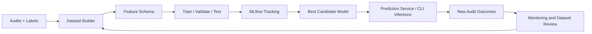
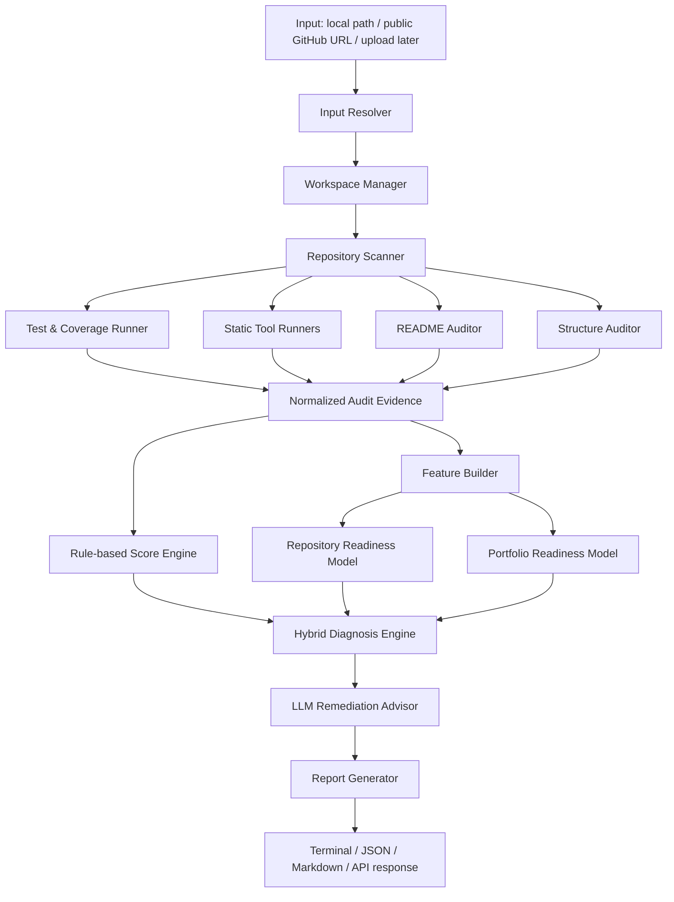

# DrRepo — Comprehensive Project Blueprint

> **Status:** Living planning document, v0.3  
> **Project name:** DrRepo  
> **Project type:** Applied AI + Machine Learning + MLOps + DevOps + Software Engineering portfolio project  
> **Primary product mode:** Repository Audit  
> **Secondary product mode:** Pull Request / Change Impact Review  
> **Initial language target:** Python  
> **Last planning update:** June 2026

---

## Document status and conventions

This is the master planning document. It is deliberately broader than the MVP and should evolve as implementation teaches us what is practical.

Each item should use one of these labels:

| Label | Meaning |
|---|---|
| **Confirmed** | Explicitly agreed and should guide current design. |
| **Proposed** | Strong current direction; may change after implementation or research. |
| **Deferred** | Valuable, but intentionally not built in the current phase. |
| **Open Question** | Requires a later decision or experiment. |
| **Rejected for now** | Intentionally excluded to avoid scope creep. |

---

# 1. Project identity

## 1.1 One-line description

**DrRepo is an evidence-driven repository health, readiness, and remediation platform that audits Python projects, predicts repository and portfolio readiness, and turns findings into prioritized improvement plans.**

## 1.2 Product promise

DrRepo should answer five practical questions:

1. **What is wrong or incomplete in this repository?**
2. **What evidence supports that finding?**
3. **How serious or important is it?**
4. **What should the developer fix first?**
5. **Did the repository improve after the fixes?**

## 1.3 Why this is not a generic AI code-review wrapper

A general AI assistant can read code and offer opinions. DrRepo must deliver a repeatable engineering workflow:

| Generic code-chat workflow | DrRepo workflow |
|---|---|
| User pastes code and asks for an opinion | System inspects an entire repository or scoped input. |
| Suggestions can be vague and inconsistent | Findings are grounded in tools, rules, traces, and explicit evidence. |
| No stable quality baseline | Multi-dimensional scores create a baseline and enable before/after comparison. |
| No execution or tool integration | The platform runs or interprets tests, coverage, linters, security tools, and repository checks where safe. |
| No project-specific prioritization | Findings are converted into a remediation backlog ordered by severity, impact, confidence, and effort. |
| AI is the entire product | AI is one layer inside a hybrid system of deterministic checks, ML models, and remediation reasoning. |

The project should be judged by the quality of its **pipeline, evidence model, feature engineering, ML lifecycle, CI integration, safety boundaries, and explainability**—not by the fact that it calls an LLM.

---

# 2. Problem statement

Developers, students, and small teams often have repositories that “work” but are not ready to be maintained, shared, reviewed, deployed, or presented professionally.

Common gaps include:

- no tests or unverified tests;
- incomplete or failing coverage;
- lint, security, complexity, and maintainability issues;
- unclear repository layout;
- weak README and setup instructions;
- missing reproducibility files such as `requirements.txt`, `.env.example`, or `.gitignore`;
- poor portfolio presentation despite technically useful work;
- no structured way to decide what to fix first;
- pull requests reviewed only by pass/fail tests, without baseline-aware quality signals.

DrRepo does not try to replace senior engineers. It provides an **evidence-based first diagnosis** and a structured improvement path.

---

# 3. Product scope

## 3.1 Confirmed core modes

### A. Repository Audit Mode — **Confirmed / primary**

A full audit of a Python repository.

Supported product inputs across the complete vision:

- local directory path;
- public GitHub repository URL;
- ZIP project upload in the future web app;
- optional browser directory selection later;
- file upload or pasted code for smaller, lower-fidelity reviews.

A full repository audit may produce:

- Repository Health / Readiness score;
- Code Quality score;
- Testing and Coverage score;
- Security score;
- Maintainability score;
- Documentation score;
- Repository Structure score;
- Portfolio Readiness score;
- ML classifier predictions and confidence;
- a prioritized remediation plan.

### B. Portfolio Readiness Mode — **Confirmed / primary**

A repository-level assessment focused on whether the project is professionally presentable for GitHub, a CV, internships, LinkedIn, or interviews.

It is not cosmetic only. It combines project presentation with reproducibility and engineering credibility.

### C. Quick File / Pasted Code Review — **Confirmed product direction; deferred implementation**

When the system sees only a file or code snippet, it must provide a scoped code review and be explicit that it cannot claim a repository-wide health score.

Example output:

```text
Scope: Single-file review
Available signals: lint, complexity, security patterns, code explanation
Unavailable signals: repository structure, test suite, documentation, dependency configuration
```

### D. Pull Request / Change Impact Review — **Confirmed / secondary**

This feature uses the same audit foundation, but focuses on what a change introduced or degraded:

- test failures or coverage regression;
- new lint/security findings;
- complexity increase;
- changed sensitive modules;
- missing tests for changed behavior;
- impact on repository baseline.

It will become a GitHub Actions quality gate after the audit engine is stable. It is **not** the first implementation focus.

---

## 3.2 Input and privacy scope

| Input path | Intended support | Status |
|---|---|---|
| Local repository | CLI audits a path supplied by the developer | First implementation |
| Public GitHub URL | Clone/download to temporary workspace | Planned after local audit |
| Private GitHub URL | Requires OAuth/app tokens, permissions, secret handling | Deferred |
| Project ZIP | Future web input | Deferred |
| Browser folder selection | Optional convenience UI | Deferred |
| Single file / pasted code | Future quick-review input | Deferred |

**Confirmed privacy decision:** private GitHub repositories are not part of the initial product scope. A user can audit a private project locally or upload an archive in a later web flow.

---

# 4. User personas

## 4.1 Primary: developers and small teams — **Confirmed**

The primary audience is developers and small teams that want a practical codebase diagnosis, repeatable quality checks, and a clear improvement plan.

## 4.2 Secondary: students and junior developers — **Confirmed**

DrRepo is especially useful for portfolio projects, but it should not be framed as a “student-only” toy. Student-oriented portfolio checks are a differentiating product mode, not the entire identity.

## 4.3 Future: reviewers, team leads, and DevOps engineers — **Supported by later modes**

The PR and CI mode gives the project a clear team/DevOps narrative without forcing it to be the initial user experience.

---

# 5. Differentiators

## 5.1 Evidence-first findings — **Confirmed**

Every important finding should contain as much evidence as available:

```text
Finding: Hardcoded secret pattern detected
Evidence: Security scanner + local pattern match
Location: config.py:14
Severity: High
Impact: Credentials may be exposed in a public repository
Suggested remediation: Move the value to an environment variable and add .env.example
```

## 5.2 Multi-dimensional health profile — **Confirmed**

The product should avoid hiding everything inside a single opaque score.

Proposed dimensions:

| Dimension | Main evidence |
|---|---|
| Code Quality | Ruff findings, naming/style signals, code smells where measurable |
| Testing | test discovery, test result, coverage, organization |
| Security | Bandit, secret patterns, unsafe operations, configuration signals |
| Maintainability | complexity, large functions/files, modularity signals |
| Documentation | README completeness, usage/setup clarity, docs signals |
| Structure | repository organization, dependency and environment files |
| Portfolio Readiness | presentation + reproducibility + engineering credibility |

## 5.3 Prioritized remediation plan — **Confirmed**

DrRepo should convert a list of findings into a practical backlog:

```text
Fix now      — security or reliability blockers
Fix next     — high-impact readiness problems
Improve later— maintainability and documentation upgrades
Nice to have — polish and presentation enhancements
```

A proposed prioritization formula is:

```text
priority = severity × impact × confidence × fixability
```

**Open Question:** the exact numeric formula and weighting should be validated after sample reports exist. The first implementation may use a deterministic priority matrix instead.

## 5.4 Audit profiles — **Proposed, high value**

An audit profile enables context-sensitive checks. Possible profiles:

- General Python Repository;
- Python CLI Tool;
- FastAPI Backend;
- Machine Learning Project;
- Data Science Project;
- Portfolio Project.

This can differentiate DrRepo from a generic linter, but must not delay the baseline audit. The first implementation may ship with one general Python profile and one portfolio emphasis profile.

## 5.5 Before/after comparison — **Proposed**

When reports are stored, DrRepo can compare audit runs:

```text
Repository Health: 61 → 80 (+19)
Testing:           42 → 71 (+29)
Documentation:     55 → 82 (+27)
```

This becomes an important dashboard and interview feature later.

---

# 6. Hybrid intelligence design

## 6.1 System principle — **Confirmed**

DrRepo will use a hybrid decision system:

```text
Deterministic evidence
+ transparent rules and scores
+ ML readiness predictions
+ LLM remediation reasoning
= explainable final diagnosis
```

No single layer should silently decide the full result.

## 6.2 Role boundaries — **Confirmed**

| Layer | Responsibility | Must not do alone |
|---|---|---|
| Tests and coverage | Demonstrate executable behavior and coverage evidence | Claim broad repository readiness |
| Static analysis | Identify factual lint/security/complexity signals | Write a remediation plan without context |
| Repository rules | Produce repeatable checks and category scores | Pretend to learn patterns from data |
| ML models | Learn broader readiness patterns from labeled examples | Override critical deterministic failures without explanation |
| LLM | Explain, synthesize, prioritize, and recommend | Be the only source of truth or sole blocker |
| Final diagnosis engine | Combine layers and preserve evidence | Hide conflicting signals |

## 6.3 Hard rules and model influence — **Proposed**

For repository audits, hard rules should be used carefully. A failing test should be prominent and heavily affect readiness, but an audit report should usually diagnose rather than “block” a repository.

For later PR quality gates, configurable hard rules may cause a failure status, such as:

- critical security finding;
- configured test failure policy;
- coverage regression beyond a configured threshold;
- analysis failure when the policy treats missing evidence as a failure.

The ML classifier should influence the final diagnosis and priority, but should not override a critical evidence-based issue.

---

# 7. Machine-learning design

## 7.1 Model 1: Repository Health / Readiness Classifier — **Confirmed final-product component**

### Purpose

Predict a broad repository readiness state based on engineered audit features.

### Proposed label space — **Open Question**

```text
needs_major_improvement
needs_improvement
repository_ready
```

The names are intentionally action-oriented. Final labels and class balance must be decided after the labeling rubric and dataset distribution are known.

### Candidate features

- source-file count, module count, line count;
- test directory presence and test count;
- test pass/fail/unknown status;
- coverage percentage and availability;
- Ruff issue counts by severity/category where available;
- Bandit/security issue counts;
- hardcoded-secret patterns;
- complexity statistics and high-complexity functions;
- dependency configuration presence;
- `.gitignore` and `.env.example` presence;
- README completeness score;
- repository structure score;
- documentation signals.

### Candidate models

1. Logistic Regression baseline;
2. Random Forest baseline;
3. Gradient Boosting / XGBoost only if justified by experiment results;
4. calibration or probability evaluation when the class output is presented as confidence.

## 7.2 Model 2: Portfolio Readiness Classifier — **Confirmed final-product component**

### Purpose

Predict whether a repository is ready to be publicly displayed as a portfolio project.

### Proposed label space — **Open Question**

```text
not_portfolio_ready
almost_ready
portfolio_ready
```

### Candidate features

- README section coverage;
- project description and problem statement evidence;
- installation and usage instructions;
- examples, demo, screenshots/GIF indicators;
- architecture, results, metrics, limitations, future-work sections;
- test and coverage signals;
- reproducibility/configuration files;
- project structure and documentation signals;
- license and metadata presence;
- profile-specific signals for ML/FastAPI/CLI projects later.

## 7.3 Dataset plan — **Confirmed direction; exact implementation deferred**

The data plan will likely be a hybrid of:

1. **manual labeling** using a written repository and portfolio rubric;
2. **selected public Python repositories** collected under transparent inclusion criteria;
3. **synthetic repositories** with deliberate good/bad patterns for tests, edge cases, and controlled experiments;
4. **audit history** later, only where labels are trustworthy and privacy rules allow it.

### Dataset quality rules — **Confirmed principles**

- Keep a versioned labeling rubric.
- Store the source/collection method and labeler for each training sample where feasible.
- Split train/validation/test by repository, not by repeated audit of the same repository.
- Avoid using a rule-derived score as the only label when the same rule inputs are features; that creates target leakage and produces a model that merely imitates the rubric.
- Compare the model against a simple deterministic baseline.
- Clearly document limitations, imbalance, and data provenance.

## 7.4 MLOps lifecycle — **Confirmed final-product direction**



MLOps practices to demonstrate:

- dataset versioning or documented snapshot strategy;
- fixed feature schema;
- reproducible training configuration and random seeds;
- experiment tracking with MLflow;
- model artifact/version handling;
- baseline vs candidate comparison;
- metrics including precision, recall, F1, confusion matrix, and calibration/confidence review where relevant;
- inference contract and model fallback;
- later monitoring of feature/prediction distributions and newly labeled outcomes.

---

# 8. LLM remediation design

## 8.1 Role — **Confirmed**

The LLM is a **remediation advisor**, not the only judge.

It should:

- turn structured evidence into plain-language explanations;
- connect related findings;
- explain why an issue matters;
- generate a prioritized fix plan;
- suggest test cases and README sections;
- later propose optional patches, never silently apply them.

## 8.2 Input contract — **Proposed**

The LLM should receive curated, bounded context rather than an entire repository blindly:

- report summary and category scores;
- top evidence-backed findings;
- relevant code snippets only;
- README excerpt or missing-section map;
- audit profile;
- user preference or desired output format.

## 8.3 Output contract — **Confirmed design principle**

Use structured JSON validated by a Pydantic schema. Invalid LLM output must not crash the audit pipeline.

Example conceptual structure:

```json
{
  "summary": "...",
  "priorities": [
    {
      "priority": "high",
      "finding_ids": ["SEC-001", "TEST-003"],
      "why_it_matters": "...",
      "recommended_actions": ["..."],
      "suggested_tests": ["..."]
    }
  ],
  "limitations": ["..."],
  "confidence_notes": ["..."]
}
```

## 8.4 Provider design — **Proposed**

Use a provider interface, beginning with a mock reviewer. Direct APIs are preferred initially over LangChain.

Possible providers later:

- OpenRouter;
- direct vendor APIs;
- Ollama/local models for privacy-oriented experiments.

LangChain/LangGraph are deferred unless a concrete multi-step, tool-using problem justifies them.

---

# 9. Deterministic audit components

## 9.1 Repository scanner — **MVP**

Discovers relevant files and folders:

- source folders and Python files;
- tests;
- README/docs;
- dependency/configuration files;
- `.gitignore`, `.env`, `.env.example`;
- Docker and CI files as signals;
- likely entry points.

## 9.2 Test and coverage runner — **MVP for local repositories**

- detect likely tests;
- run `pytest` when configured and safe in local mode;
- obtain coverage when available;
- distinguish “not found,” “not runnable,” “failed,” and “passed” rather than treating all missing evidence as the same.

## 9.3 Static analysis — **MVP**

Initial tools:

- Ruff;
- Bandit;
- Radon.

Possible later additions:

- Mypy;
- Semgrep;
- pip-audit / dependency vulnerability checks;
- profile-specific linters and IaC checks.

## 9.4 README auditor — **MVP / rule-based first**

Checks may include:

- title and concise project description;
- problem statement and features;
- install/setup instructions;
- usage example;
- tech stack;
- configuration/environment guidance;
- architecture explanation;
- results/metrics when relevant;
- demo/screenshots indicators;
- limitations/future work;
- author/contact/license sections.

## 9.5 Structure auditor — **MVP / rule-based first**

Checks for understandable organization and reproducibility signals:

- source/test/docs separation where appropriate;
- dependency file;
- configuration convention;
- `.gitignore`;
- environment template where relevant;
- generated/cache artifacts committed unintentionally;
- a clear entry point;
- explanation of notebooks/scripts where necessary.

---

# 10. Scoring and diagnosis

## 10.1 Repository Health Score — **Proposed initial weights**

| Dimension | Proposed weight |
|---|---:|
| Code Quality | 20 |
| Testing | 20 |
| Security | 20 |
| Documentation | 15 |
| Repository Structure | 15 |
| Maintainability | 10 |

These weights are a starting point, not a final scientific truth. They should be configurable and documented.

## 10.2 Portfolio Readiness Score — **Proposed initial weights**

| Dimension | Proposed weight |
|---|---:|
| README and narrative | 30 |
| Setup and reproducibility | 20 |
| Structure and engineering signals | 15 |
| Tests and quality evidence | 15 |
| Demo / results / presentation | 10 |
| Professional polish | 10 |

## 10.3 Score use — **Confirmed principle**

Scores must be accompanied by:

- raw evidence;
- missing/unknown signals;
- assumptions;
- a textual diagnosis;
- prioritized recommendations.

A score is an aid to decision-making, not a guarantee of quality.

## 10.4 Diagnosis labels — **Proposed**

Repository audit:

```text
healthy
needs_attention
needs_improvement
needs_major_improvement
```

Portfolio audit:

```text
not_portfolio_ready
almost_ready
portfolio_ready
```

PR mode later:

```text
mergeable
needs_work
blocked
```

---

# 11. Architecture direction

## 11.1 Logical flow



## 11.2 Design rule: one core engine, multiple interfaces — **Confirmed**

The analyzer should be reusable across:

- CLI;
- GitHub URL audit;
- future FastAPI web backend;
- GitHub Actions PR mode;
- tests and sample repositories.

The CLI should call the same service layer that a web API will call later. UI/transport logic must not contain the audit logic.

## 11.3 Web safety boundary — **Confirmed architecture concern**

A web server must not blindly execute arbitrary user code.

Initial web analysis should prioritize static inspection. Any execution of untrusted tests/scripts requires a hardened isolation plan such as a constrained container with:

- no host filesystem access;
- limited CPU/memory;
- timeout;
- restricted network;
- temporary workspace cleanup;
- explicit command allowlist;
- safe handling of archives and path traversal.

This is not required for the CLI MVP, where the user controls the repository and machine, but it must shape future web architecture.

---

# 12. Technology decisions

| Area | Choice | Status | Notes |
|---|---|---|---|
| Implementation language | Python | Confirmed | First language supported by audit engine. |
| CLI | Typer | Proposed | `argparse` remains a fallback if minimizing dependencies wins. |
| Test runner | Pytest | Confirmed | Local execution first. |
| Coverage | coverage.py | Confirmed | Parse explicit availability/error states. |
| Lint | Ruff | Confirmed | Prefer structured output. |
| Security | Bandit | Confirmed | Supplement with simple local patterns later. |
| Complexity | Radon | Confirmed | Used for maintainability signals. |
| API | FastAPI | Confirmed direction | Implement after core service boundary is stable. |
| Reports | Markdown + JSON + terminal summary | Confirmed | HTML/PDF later. |
| ML | scikit-learn | Confirmed first choice | Simple baselines before heavier models. |
| Experiment tracking | MLflow | Confirmed final-model phase | Not required in the earliest MVP. |
| Storage | SQLite | Proposed initial storage | Needed when history/dashboard starts. |
| CI | GitHub Actions | Confirmed | PR integration later. |
| Containers | Docker | Confirmed direction | Packaging + later web execution isolation. |
| LLM provider | Configurable interface | Confirmed design | Specific hosted/local provider remains open. |
| Web UI | simple UI / Streamlit / templates | Open Question | Choose after engine/API exists. |

---

# 13. Scope by delivery stage

## MVP 1 — Local Repository Audit — **Confirmed**

```text
Local Python repository
→ scan
→ deterministic audit
→ rule-based scoring
→ Markdown/JSON/terminal report
```

Included:

- local path input;
- repository scanner;
- Ruff, Bandit, Radon;
- test discovery, pytest/coverage where feasible;
- README and structure checks;
- transparent category scores;
- diagnosis and prioritized rule-based plan;
- unit tests for parsers/scoring;
- good/bad sample repositories.

Excluded:

- web app;
- GitHub URL cloning;
- LLM;
- trained models;
- MLflow;
- PR automation;
- private GitHub support;
- dashboard;
- multi-language support.

## Final portfolio vision — **Confirmed direction, not MVP scope**

- all repository input modes;
- both ML classifiers;
- MLflow and reproducible model pipeline;
- LLM remediation advisor;
- GitHub URL audit;
- PR change-impact review and GitHub Actions;
- web app and report history;
- Dockerized packaging and optional monitoring.

---

# 14. Roadmap summary

| Phase | Outcome |
|---|---|
| 0 | Documentation, repository setup, interfaces and sample fixtures |
| 1 | CLI and local repository scanner |
| 2 | Deterministic tool runners and normalized evidence |
| 3 | README/structure/portfolio rules, scores, diagnosis, reports |
| 4 | Public GitHub URL audit |
| 5 | Dataset rubric, collection pipeline, feature engineering |
| 6 | Repository and portfolio classifiers with MLflow |
| 7 | LLM remediation advisor |
| 8 | PR Change Impact Review and GitHub Actions |
| 9 | Web app, uploads, history, and dashboard |
| 10 | Docker, hardening, observability, final presentation |

Detailed milestones are in [`ROADMAP.md`](ROADMAP.md).

---

# 15. Proposed repository layout

```text
drrepo/
├── drrepo/
│   ├── __init__.py
│   ├── cli.py
│   ├── config.py
│   ├── models.py
│   ├── input/
│   │   ├── resolver.py
│   │   ├── git.py
│   │   └── workspace.py
│   ├── scanner/
│   │   ├── repository_scanner.py
│   │   ├── file_discovery.py
│   │   └── metadata.py
│   ├── analyzers/
│   │   ├── base.py
│   │   ├── ruff_runner.py
│   │   ├── bandit_runner.py
│   │   ├── radon_runner.py
│   │   ├── pytest_runner.py
│   │   ├── coverage_runner.py
│   │   └── parsers.py
│   ├── audits/
│   │   ├── readme_auditor.py
│   │   ├── structure_auditor.py
│   │   ├── portfolio_auditor.py
│   │   └── security_patterns.py
│   ├── features/
│   │   ├── schema.py
│   │   ├── builder.py
│   │   └── validation.py
│   ├── scoring/
│   │   ├── repository_score.py
│   │   ├── portfolio_score.py
│   │   └── rules.py
│   ├── diagnosis/
│   │   ├── engine.py
│   │   ├── priority.py
│   │   └── recommendations.py
│   ├── ml/
│   │   ├── dataset.py
│   │   ├── labels.py
│   │   ├── train.py
│   │   ├── evaluate.py
│   │   ├── predict.py
│   │   └── registry.py
│   ├── llm/
│   │   ├── base.py
│   │   ├── mock_reviewer.py
│   │   ├── provider.py
│   │   ├── prompts.py
│   │   └── schemas.py
│   ├── reports/
│   │   ├── markdown_report.py
│   │   ├── json_report.py
│   │   └── terminal_summary.py
│   ├── github/
│   │   ├── diff.py
│   │   ├── actions.py
│   │   └── comments.py
│   ├── api/
│   │   ├── main.py
│   │   ├── routes.py
│   │   └── schemas.py
│   └── storage/
│       ├── database.py
│       └── repositories.py
├── docs/
├── examples/
│   ├── sample_good_repo/
│   ├── sample_bad_repo/
│   └── sample_portfolio_repo/
├── tests/
├── reports/
├── .github/workflows/
├── pyproject.toml
├── .drrepo.yml
├── Dockerfile
├── README.md
└── LICENSE
```

This is a **target layout**, not a requirement to create every folder on day one. Create modules only when a phase needs them.

---

# 16. Configuration direction

A proposed `.drrepo.yml` design:

```yaml
analysis:
  language: python
  run_tests: true
  run_coverage: true
  run_lint: true
  run_security: true
  run_complexity: true
  run_readme_audit: true
  run_structure_audit: true
  run_llm_remediation: false

thresholds:
  repository_minimum_score: 60
  portfolio_minimum_score: 70
  coverage_minimum_percentage: 60

security:
  flag_env_files: true
  block_on_critical_in_pr_mode: true

llm:
  provider: mock
  model: none
  max_context_files: 20

output:
  markdown: true
  json: true
  terminal_summary: true
```

**Open Question:** YAML versus a `pyproject.toml` section. Start with one simple configuration path and avoid supporting both too early.

---

# 17. Risks and mitigations

| Risk | Why it matters | Mitigation |
|---|---|---|
| Scope explosion | The project spans audit, ML, LLM, web, CI, MLOps, and DevOps. | Enforce phased delivery and acceptance criteria. |
| Weak ML data | A classifier trained on poor labels is not credible. | Hybrid data plan, rubric, baseline comparison, limitation reporting. |
| Target leakage | Model appears accurate because it learns a rule used to make the label. | Independent labels where feasible; audit feature/label review; holdout by repository. |
| LLM inconsistency | LLM may hallucinate or output invalid structure. | Evidence-first prompts, structured schema, validation, fallback. |
| Untrusted code execution | Uploaded tests/scripts can be malicious. | Static-only web analysis first; sandbox later. |
| GitHub URL reliability | Cloning can fail or repos may be large. | Size/time limits, cleanup, clear errors, local path first. |
| Subjective scoring | Users may disagree with thresholds. | Explain evidence, expose configuration, document limitations. |
| Frontend time sink | UI may delay the actual engine. | Build CLI/API core first. |
| ML as decoration | A model trained on trivial labels adds little value. | Explicit data/labeling methodology and meaningful comparison. |

---

# 18. Engineering workflow

## Principles — **Confirmed**

1. Build a small working slice before building the next layer.
2. Preserve a stable baseline; commit after meaningful working blocks.
3. Test parsers and scoring logic early.
4. Keep raw tool output for debugging, but expose normalized models to the rest of the system.
5. Treat missing/failed/unknown evidence differently.
6. Keep the LLM optional and non-blocking initially.
7. Document major changes in this blueprint or a later decisions log.
8. Use sample repositories designed to test both happy and failure paths.

## Branch examples

```text
feature/repository-scanner
feature/static-analysis
feature/readme-structure-audit
feature/scoring-reports
feature/github-url-input
feature/dataset-pipeline
feature/readiness-classifiers
feature/llm-remediation
feature/pr-change-impact
feature/web-app
```

---

# 19. Success criteria

## MVP success

- A local Python repository can be audited with one CLI command.
- The report accurately distinguishes available, missing, failed, and unknown evidence.
- The system produces readable Markdown and machine-readable JSON.
- Scores are transparent and tied to evidence.
- The system runs on controlled sample repositories and at least one real project.

## Final portfolio-project success

- DrRepo supports both readiness models with documented datasets, evaluation, and MLflow experiments.
- The model output is compared against deterministic rules and presented with limitations.
- The LLM produces validated remediation plans grounded in findings.
- Public GitHub URL audit reuses the same core engine.
- PR Change Impact Review works through GitHub Actions.
- Docker packaging and clear documentation make the project reproducible.
- The system can be explained in a two-minute interview walkthrough without exaggerating what it does.

---

# 20. Interview narrative

> **I built DrRepo, an evidence-driven repository health and remediation platform for Python projects. The audit engine combines test and coverage results, static analysis, security scanning, complexity metrics, README and structure checks, then exposes transparent health dimensions. I added two supervised ML classifiers—repository readiness and portfolio readiness—using a documented hybrid dataset strategy and MLflow experiment tracking. An LLM layer does not replace the checks; it converts validated findings into a prioritized remediation plan. The same core engine later powers GitHub Actions-based pull request change-impact review.**

---

# 21. Immediate next step

Implement the first vertical slice:

```text
Local path
→ repository scan
→ metadata summary
→ JSON output
→ test fixture
```

Do **not** begin with the web app, LLM, classifier, dashboard, or GitHub Action. The first vertical slice establishes the evidence contract that every later component depends on.
